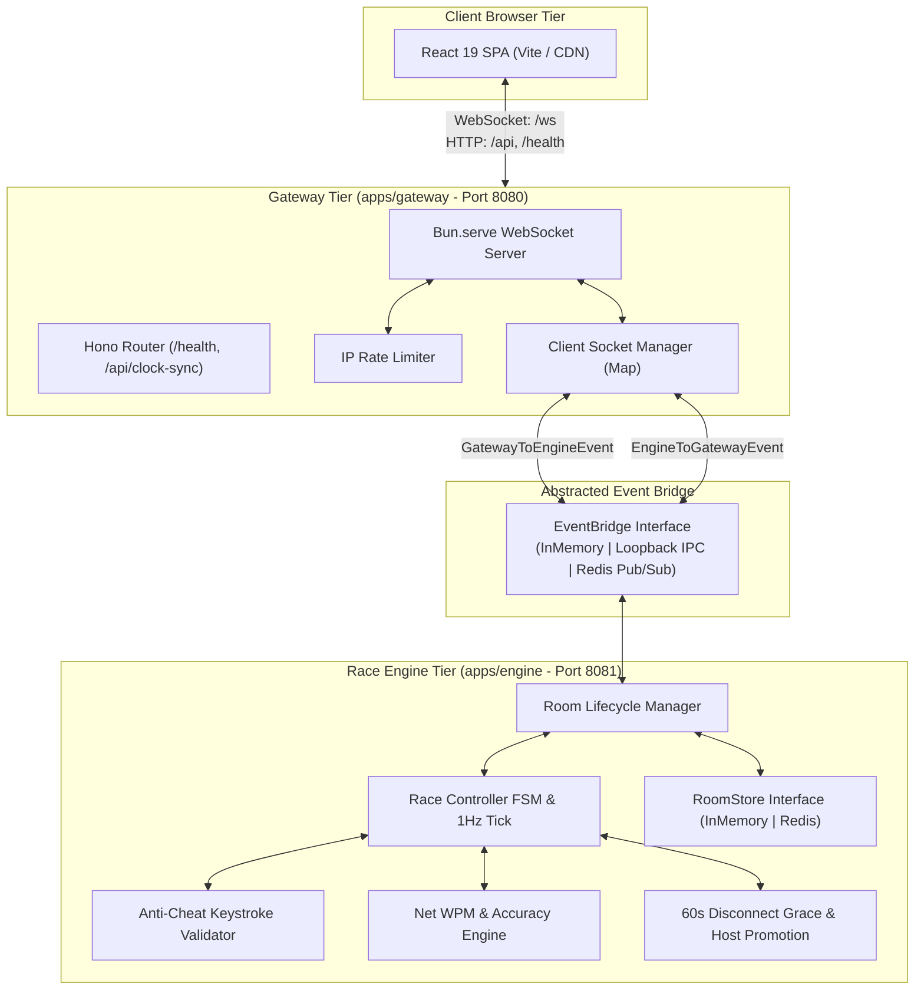
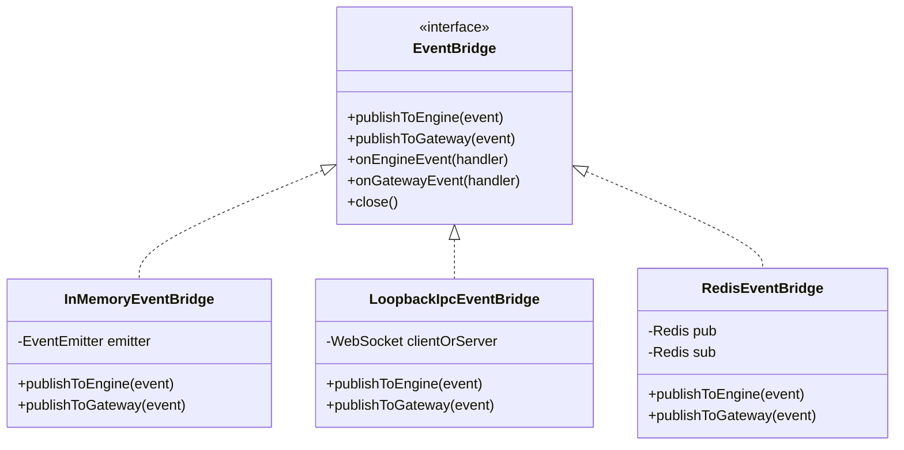
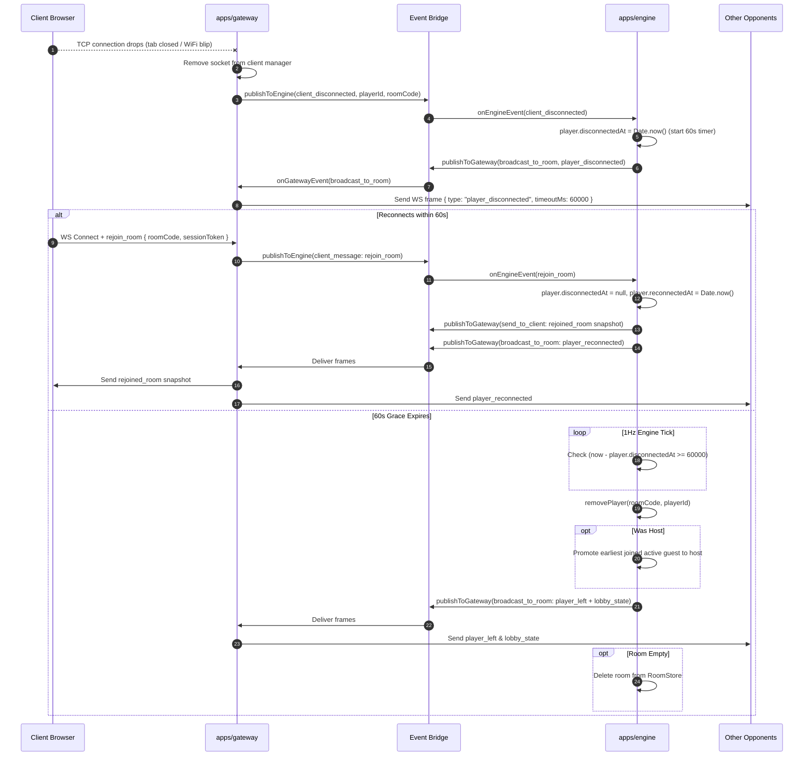
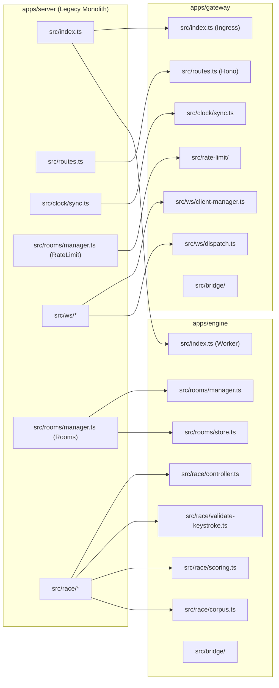

# Phase 7: Split into N-tier Architecture — Research

**Date:** 2026-09-04  
**Status:** Completed  
**Domain:** System Architecture / Distributed Systems / Real-time Game Networking  
**Targets:** `apps/web`, `apps/gateway`, `apps/engine`, `packages/shared`

---

## 1. Executive Summary

Phase 7 decomposes the monolithic Bun server (`apps/server`) into a decoupled 3-tier architecture:
1. **Presentation Tier (`apps/web`)**: Pure static React 19 + Vite client, CDN-ready and decoupled from backend runtimes.
2. **Real-time Gateway Tier (`apps/gateway`)**: Bun-native WebSocket server + Hono HTTP router responsible for client socket lifecycle, connection upgrades, heartbeat ping/pongs, and IP rate limiting.
3. **Race Engine Tier (`apps/engine`)**: Headless game simulation worker owning the race FSM loop, anti-cheat validation, WPM scoring, room lifecycle, host promotion, and the 60-second disconnect grace timer.
4. **Shared Contract Tier (`packages/shared`)**: Canonical wire schemas, event bridge protocols, room code generation, and passage corpus.

### Key Architectural Wins
- **Zero-Install Local Development**: Laptop development requires zero Docker, zero external Redis, and zero cloud credentials. `bun run dev` runs all tiers locally with sub-millisecond in-memory or loopback IPC communication.
- **Pluggable Multi-Instance Scaling**: Seamlessly switches to Redis Pub/Sub and Redis state adapters when `REDIS_URL` is supplied in production without code modifications.
- **Clean Socket / Game State Boundary**: Gateway has zero knowledge of game rules or race timing; Engine holds zero WebSocket references. Communication flows through an abstracted, strongly-typed Event Bridge.
- **Dual-Mode Orchestration**: Run unified in a single OS process (`MODE=unified`) for minimal overhead or split across dedicated processes (`MODE=split`) for isolated debugging and multi-container deployments.

---

## 2. Architecture Overview & Tier Boundaries



### Tier Demarcation Matrix

| Responsibility | Presentation (`apps/web`) | Gateway (`apps/gateway`) | Engine (`apps/engine`) | Shared (`packages/shared`) |
| :--- | :---: | :---: | :---: | :---: |
| UI Rendering & Cursors | **Primary** | — | — | — |
| Local Clock Skew Correction | **Primary** | — | — | — |
| WebSocket Upgrade & TCP Framing | — | **Primary** | — | — |
| Heartbeat Ping/Pong (15s/5s) | — | **Primary** | — | — |
| HTTP `/health` & `/api/clock-sync` | — | **Primary** | — | — |
| IP Rate Limiting (10 rooms/hr) | — | **Primary** | — | — |
| Client Frame Validation (`safeParse`) | — | **Primary** | — | Schemas |
| Socket-to-PlayerId Mapping | — | **Primary** | — | — |
| Room Creation & 6-Char Code Gen | — | Forwarder | **Primary** | Alphabet/Helper |
| Race State Machine (`lobby` $\leftrightarrow$ `racing`) | — | — | **Primary** | Enums |
| Anti-Cheat Keystroke Validation | — | — | **Primary** | — |
| Net WPM & Accuracy Math | — | — | **Primary** | Formulas |
| 60s Disconnect Grace Timer | — | Event Source | **Primary** | — |
| Host Promotion on Leave/Timeout | — | — | **Primary** | — |
| Wire Contracts & Schemas | Consumer | Consumer | Consumer | **Primary** |

---

## 3. Package Structure & Workspace Dependencies

### Directory Tree

```
typing-race/
├── apps/
│   ├── web/                        # Pure static client (React 19 + Vite + Tailwind 4)
│   │   ├── src/
│   │   ├── package.json
│   │   ├── vite.config.ts
│   │   └── Dockerfile              # Static container (Caddy / Bun static)
│   ├── gateway/                    # Real-time WebSocket gateway
│   │   ├── src/
│   │   │   ├── index.ts            # Bun.serve ingress (PORT=8080)
│   │   │   ├── routes.ts           # Hono HTTP endpoints
│   │   │   ├── env.ts              # Gateway config (PORT, MODE, REDIS_URL)
│   │   │   ├── logger.ts           # Structured Pino logger
│   │   │   ├── clock/sync.ts       # Clock sync NTP handler
│   │   │   ├── rate-limit/         # In-memory IP rate limiter
│   │   │   ├── ws/
│   │   │   │   ├── handlers.ts     # WS upgrade, typed WsData, hello/pong
│   │   │   │   ├── client-manager.ts # Active sockets & room membership
│   │   │   │   └── dispatch.ts     # Client frame decode & forward to bridge
│   │   │   └── bridge/             # Gateway bridge consumer & factory
│   │   ├── package.json
│   │   ├── tsconfig.json
│   │   └── Dockerfile              # Bun runtime container
│   └── engine/                     # Headless race loop & room manager
│       ├── src/
│       │   ├── index.ts            # Engine bootstrap & tick loop
│       │   ├── env.ts              # Engine config (ENGINE_PORT, REDIS_URL)
│       │   ├── logger.ts           # Structured Pino logger
│       │   ├── race/
│       │   │   ├── controller.ts   # FSM state transitions & 1Hz tick
│       │   │   ├── validate-keystroke.ts # 4 anti-cheat checks & char-state
│       │   │   ├── scoring.ts      # Net WPM & accuracy algorithms
│       │   │   ├── corpus.ts       # Deck shuffle & no-repeat deal
│       │   │   ├── types.ts        # Domain types (Player, Room, CharState)
│       │   │   └── frames.ts       # ServerToClient frame builders
│       │   ├── rooms/
│       │   │   ├── manager.ts      # Room CRUD, player add/rebind/remove
│       │   │   └── store.ts        # RoomStore interface (InMemory & Redis)
│       │   └── bridge/             # Engine bridge consumer & IPC server
│       ├── package.json
│       ├── tsconfig.json
│       └── Dockerfile              # Headless Bun runtime container
├── packages/
│   └── shared/                     # Canonical wire contracts & logic
│       ├── src/
│       │   ├── index.ts
│       │   ├── messages.ts         # ClientToServer & ServerToClient Zod schemas
│       │   ├── bridge.ts           # Inter-service event contracts & EventBridge interface
│       │   ├── codes.ts            # nanoid 6-char room code generator
│       │   ├── passages.ts         # Bundled passage corpus
│       │   └── race.ts             # Domain primitives (RaceState, PlayerSummary)
│       ├── package.json
│       └── tsconfig.json
├── docker-compose.yml              # Multi-tier local/prod orchestration
├── Dockerfile                      # Single-deploy unified fallback (Fly.io)
├── package.json                    # Monorepo root scripts & devDependencies
└── bun.lock
```

### Workspace Dependencies & Package Configurations

#### `packages/shared/package.json`
```json
{
  "name": "@typing-race/shared",
  "private": true,
  "type": "module",
  "main": "./src/index.ts",
  "types": "./src/index.ts",
  "exports": {
    ".": "./src/index.ts",
    "./bridge": "./src/bridge.ts"
  },
  "dependencies": {
    "nanoid": "6.0.1",
    "zod": "4.5.4"
  },
  "devDependencies": {
    "@types/bun": "1.4.0",
    "typescript": "^5.6.3"
  }
}
```

#### `apps/gateway/package.json`
```json
{
  "name": "@typing-race/gateway",
  "private": true,
  "type": "module",
  "main": "src/index.ts",
  "scripts": {
    "dev": "bun --hot run src/index.ts",
    "start": "bun run src/index.ts",
    "typecheck": "tsc --noEmit",
    "test": "bun test"
  },
  "dependencies": {
    "@typing-race/shared": "workspace:*",
    "hono": "4.13.5",
    "ioredis": "^5.4.1",
    "pino": "10.3.1",
    "zod": "4.5.4"
  },
  "devDependencies": {
    "@types/bun": "1.4.0",
    "@types/ioredis": "^5.0.0",
    "pino-pretty": "13.1.3",
    "typescript": "^5.6.3"
  }
}
```

#### `apps/engine/package.json`
```json
{
  "name": "@typing-race/engine",
  "private": true,
  "type": "module",
  "main": "src/index.ts",
  "scripts": {
    "dev": "bun --hot run src/index.ts",
    "start": "bun run src/index.ts",
    "typecheck": "tsc --noEmit",
    "test": "bun test"
  },
  "dependencies": {
    "@typing-race/shared": "workspace:*",
    "ioredis": "^5.4.1",
    "nanoid": "6.0.1",
    "pino": "10.3.1",
    "zod": "4.5.4"
  },
  "devDependencies": {
    "@types/bun": "1.4.0",
    "@types/ioredis": "^5.0.0",
    "pino-pretty": "13.1.3",
    "typescript": "^5.6.3"
  }
}
```

---

## 4. Inter-Service Communication & Event Bridge Design

### Event Bridge Contract (`packages/shared/src/bridge.ts`)

```ts
import type { ClientToServer, ServerToClient } from "./messages.ts";

/** Inbound events: Gateway -> Engine */
export type GatewayToEngineEvent =
  | {
      type: "client_connected";
      playerId: string;
      ip: string;
      serverTs: number;
    }
  | {
      type: "client_disconnected";
      playerId: string;
      roomCode: string | null;
      serverTs: number;
    }
  | {
      type: "client_message";
      playerId: string;
      roomCode: string | null;
      ip: string;
      clientOffsetMs: number;
      message: ClientToServer;
      serverTs: number;
    };

/** Outbound events: Engine -> Gateway */
export type EngineToGatewayEvent =
  | {
      type: "broadcast_to_room";
      roomCode: string;
      payload: ServerToClient;
      excludePlayerId?: string;
    }
  | {
      type: "send_to_client";
      playerId: string;
      payload: ServerToClient;
    }
  | {
      type: "disconnect_client";
      playerId: string;
      code?: number;
      reason?: string;
    }
  | {
      type: "player_room_assigned";
      playerId: string;
      roomCode: string;
    }
  | {
      type: "player_room_cleared";
      playerId: string;
      roomCode: string;
    };

export interface EventBridge {
  publishToEngine(event: GatewayToEngineEvent): Promise<void> | void;
  publishToGateway(event: EngineToGatewayEvent): Promise<void> | void;
  onEngineEvent(handler: (event: GatewayToEngineEvent) => Promise<void> | void): () => void;
  onGatewayEvent(handler: (event: EngineToGatewayEvent) => Promise<void> | void): () => void;
  close(): Promise<void> | void;
}
```

### Event Bridge Adapters



#### 1. In-Memory Adapter (`InMemoryEventBridge`)
- **Use Case**: Local development in unified mode (`MODE=unified`) or automated unit/integration tests.
- **Characteristics**: Sub-microsecond dispatch, zero JSON serialization overhead, zero external dependencies. Backed by `node:events` `EventEmitter`.

#### 2. Loopback IPC Adapter (`LoopbackIpcEventBridge`)
- **Use Case**: Local development in split mode (`MODE=split`) without Redis or Docker.
- **Characteristics**: Engine opens internal WebSocket server on `127.0.0.1:ENGINE_PORT` (`8081`). Gateway establishes a persistent loopback connection. Frame overhead < 0.5ms. Includes exponential reconnect backoff if Engine restarts.

#### 3. Redis Pub/Sub Adapter (`RedisEventBridge`)
- **Use Case**: Production distributed multi-container deployments.
- **Characteristics**: Transparently activates when `REDIS_URL` is set. Channels: `typing_race:to_engine` and `typing_race:to_gateway`. Multiple Gateway instances publish to Engine; Engine broadcasts to all Gateways, enabling full horizontal elasticity.

---

## 5. State Management & Disconnect Grace Handling

### Separation of State
- **Gateway**: Completely stateless regarding game rules. Only maintains a fast lookup `Map<PlayerId, ServerWebSocket<WsData>>` and room membership index `Map<RoomCode, Set<PlayerId>>`.
- **Engine**: Authoritative owner of all rooms, player progression, anti-cheat timestamp validations, and the 60s disconnect grace period. Holds **NO** network socket handles.

### 60-Second Disconnect Grace Flow



### RoomStore Abstraction (`apps/engine/src/rooms/store.ts`)

```ts
import type { Room } from "../race/types.ts";

export interface RoomStore {
  get(code: string): Promise<Room | null> | Room | null;
  set(code: string, room: Room): Promise<void> | void;
  delete(code: string): Promise<boolean> | boolean;
  has(code: string): Promise<boolean> | boolean;
  list(): Promise<Room[]> | Room[];
}

export class InMemoryRoomStore implements RoomStore {
  private rooms = new Map<string, Room>();

  get(code: string): Room | null {
    return this.rooms.get(code) ?? null;
  }
  set(code: string, room: Room): void {
    this.rooms.set(code, room);
  }
  delete(code: string): boolean {
    return this.rooms.delete(code);
  }
  has(code: string): boolean {
    return this.rooms.has(code);
  }
  list(): Room[] {
    return Array.from(this.rooms.values());
  }
}
```

---

## 6. Local Development & Port Strategy

### Port Allocations

| Service | Environment Variable | Default Port | Exposure | Description |
| :--- | :--- | :--- | :--- | :--- |
| **Web** | `WEB_PORT` / `VITE_PORT` | `5173` | Public / Localhost | Vite React 19 dev server |
| **Gateway** | `GATEWAY_PORT` / `PORT` | `8080` | Public / Localhost | Ingress Bun.serve WebSocket + HTTP |
| **Engine** | `ENGINE_PORT` | `8081` | Internal Loopback | Headless IPC socket (split mode) |
| **Redis** | `REDIS_URL` | `6379` | Internal | Optional distributed Pub/Sub adapter |

### Root Orchestration Scripts (`package.json`)

```json
{
  "name": "typing-race",
  "private": true,
  "type": "module",
  "workspaces": ["apps/*", "packages/*"],
  "scripts": {
    "dev": "concurrently -k -n web,gateway,engine -c green,blue,magenta \"bun run dev:web\" \"bun run dev:gateway\" \"bun run dev:engine\"",
    "dev:unified": "concurrently -k -n web,server -c green,blue \"bun run dev:web\" \"MODE=unified bun run dev:gateway\"",
    "dev:web": "bun run --cwd apps/web dev",
    "dev:gateway": "bun run --cwd apps/gateway dev",
    "dev:engine": "bun run --cwd apps/engine dev",
    "typecheck": "bun run --cwd packages/shared typecheck && bun run --cwd apps/web typecheck && bun run --cwd apps/gateway typecheck && bun run --cwd apps/engine typecheck",
    "test": "bun test packages/shared apps/gateway apps/engine && bun run --cwd apps/web test",
    "build": "bun run --cwd apps/web build"
  },
  "devDependencies": {
    "concurrently": "^9.1.0",
    "typescript": "^5.6.3"
  }
}
```

### Vite Dev Proxy (`apps/web/vite.config.ts`)
The Vite proxy routes browser `/ws`, `/api`, and `/health` requests directly to `GATEWAY_PORT` (8080). This ensures the SPA functions single-origin during development and requires zero changes to frontend API fetch or WebSocket client logic.

---

## 7. Docker & Deployment Strategy

### Multi-Container Topology (`docker-compose.yml`)

```yaml
version: "3.8"

services:
  redis:
    image: redis:7-alpine
    ports:
      - "6379:6379"
    healthcheck:
      test: ["CMD", "redis-cli", "ping"]
      interval: 5s
      timeout: 3s
      retries: 5

  engine:
    build:
      context: .
      dockerfile: apps/engine/Dockerfile
    environment:
      - NODE_ENV=production
      - ENGINE_PORT=8081
      - REDIS_URL=redis://redis:6379
    depends_on:
      redis:
        condition: service_healthy
    restart: unless-stopped

  gateway:
    build:
      context: .
      dockerfile: apps/gateway/Dockerfile
    ports:
      - "8080:8080"
    environment:
      - NODE_ENV=production
      - PORT=8080
      - REDIS_URL=redis://redis:6379
    depends_on:
      redis:
        condition: service_healthy
      engine:
        condition: service_started
    healthcheck:
      test: ["CMD", "bun", "-e", "fetch('http://localhost:8080/health').then(r => process.exit(r.ok ? 0 : 1)).catch(() => process.exit(1))"]
      interval: 10s
      timeout: 3s
      retries: 3
    restart: unless-stopped

  web:
    build:
      context: .
      dockerfile: apps/web/Dockerfile
    ports:
      - "5173:80"
    depends_on:
      - gateway
    restart: unless-stopped
```

### Tier Dockerfiles

1. **`apps/web/Dockerfile`**:
   - Multi-stage build.
   - Stage 1: Bun 1.3.2 runs `bun x vite build`.
   - Stage 2: Caddy or Nginx Alpine serves static SPA assets on port 80.
2. **`apps/gateway/Dockerfile`**:
   - `oven/bun:1.3.2-slim`. Copies `packages/shared` and `apps/gateway`.
   - Exposes port 8080 with healthcheck on `/health`.
3. **`apps/engine/Dockerfile`**:
   - `oven/bun:1.3.2-slim`. Copies `packages/shared` and `apps/engine`.
   - Runs headless game loop connected to Redis or internal IPC.
4. **Root `Dockerfile` (Single-Deploy Unified Fallback)**:
   - Preserved for Fly.io free tier (`fly.toml`), running unified gateway + engine + static client in a single container.

---

## 8. Migration Plan & File Reorganization

### Cutover Matrix (`apps/server` $\rightarrow$ `apps/gateway` & `apps/engine`)



### Known Codebase Fixes During Migration
Two minor TypeScript typing errors in existing codebase to fix during file migration:
1. `apps/server/src/race/validate-keystroke.ts:155`:
   - *Problem*: `finishedAtServerMs` narrowed to `null` due to guard `if (finishedAtServerMs === null)`.
   - *Fix*: Type annotation `let finishedAtServerMs: number | null = player.finishedAtServerMs;`.
2. `apps/server/src/__tests__/validate-keystroke.test.ts:500`:
   - *Problem*: String literal `" "` in `CharState[]` fixture.
   - *Fix*: Replace with valid `CharState` `"pending"`.

---

## Validation Architecture

### Verification Commands

```bash
# 1. Full Monorepo Typecheck
bun run typecheck

# 2. Package-level Unit & Logic Tests
bun test packages/shared
bun test apps/engine
bun test apps/gateway
bun run --cwd apps/web test

# 3. Dual-Mode Verification
# Mode A: Split mode (web :5173, gateway :8080, engine :8081)
bun run dev &
# Mode B: Unified mode (web :5173, gateway+engine :8080)
bun run dev:unified &

# 4. Container Orchestration Sanity
docker compose config
```

### Verification Criteria
1. **Zero Regression**: All 96 existing server tests and 74 client tests pass without modification to business logic.
2. **Decoupled Boundary**: `apps/engine` has zero imports of `Bun.ServerWebSocket` or `@types/ws`.
3. **Graceful Disconnect**: Simulating a WS disconnect triggers the 60-second grace state in Engine and properly notifies remaining clients. Rejoining restores complete race snapshot.
4. **Independent Startup**: Gateway boots and serves `/health` even before Engine connects, establishing connection cleanly when Engine becomes available.

---

## RESEARCH COMPLETE
